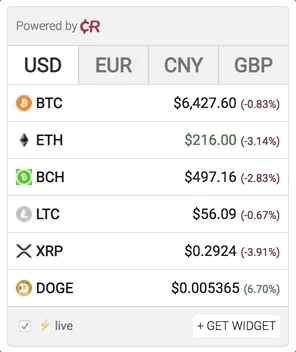
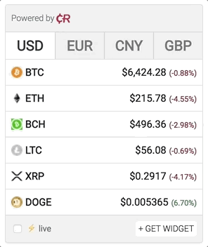

<h1 align="center">Cryptocurrency Price Widget</h1>

Customizable Cryptocurrency Price Widget with ⚡real-time price update and flexible settings.

### Why use Cryptocurrency Price Widget? ###
Does not consume resources of your site, written in pure JavaScript. Calculations and data are processed on a third-party server. Real-time streaming price update and flexible settings — it's looks like amazing and beautiful.

- [Features](#features)
- [Installation](#installation)
- [FAQ](#faq)
- [License](#license)

### Features ###
- [x] Pure JavaScript ~ __8.4__ kBytes (gzip), no dependencies;
- [x] Flexible settings and customizable design;
- [x] Real-time ⚡streaming price update;
- [x] Processed on a third-party server;
- [x] 2,966 cryptocurrencies and 162 fiat currencies;
- [x] SSL support;
- [x] IE9+ support;
- [x] SEO-friendly.

### Installation ###

Go to the __[website](https://co-in.io/)__ to generate a custom widget script
You can see __[examples](https://co-in.io/examples.html)__.

### Options ###
- __Select vertical__ — basically it's fiat currency, but you can choose cryptocurrency;
- __Select horizontal__ — basically it's cryptocurrency, but you can choose fiat currency;
- __Color__ — color of block widget;
- __Streaming data__ — prices are updated by the flow 🌧️ in real-time;
- __Striped__ — striped line;
- __Rounded__ — rounded corners of block widget;
- __Shadow__ — shadow of block widget;
- __Border__ — border around of block widget;
- __Widget script__ — ready script of widget.

### FAQ ###
  1. - __Q.__ How to make fixed width?
     - __A.__ Make div tag with style width and insert widget script inside. Try to keep the width at least 220px.

### License ###
This widget is distributed under [MIT](https://choosealicense.com/licenses/mit/) license.
*You can use this widget for free on your sites. Nevertheless, due to the fact that we take on all the workload (third-party server), we need to pay for the equipment and we would like to receive from you, something in replacement, for example, DO NOT delete the backlink in the widget.*

___
Powered by [CurrencyRate.Today](https://currencyrate.today) 
